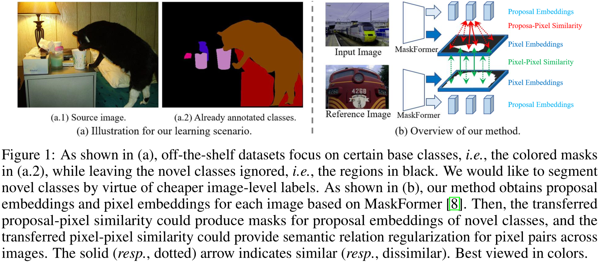

# Weak-shot Semantic Segmentation via Dual Similarity Transfer

This repository contains the official PyTorch implementation of the following paper:

> **Weak-shot Semantic Segmentation via Dual Similarity Transfer**<br>
>
> Junjie Chen, [Li Niu](http://bcmi.sjtu.edu.cn/home/niuli/), Siyuan Zhou, Jianlou Si, Chen Qian, and Liqing Zhang<br>MoE Key Lab of Artificial Intelligence, Shanghai Jiao Tong University<br>
> https://arxiv.org/abs/2210.02270 <br> Accepted by **NeurIPS2022**.

## Abstract
Semantic segmentation is a practical and active task, but severely suffers from the expensive cost of pixel-level labels when extending to more classes in wider applications.
To this end, we focus on the problem named weak-shot semantic segmentation, where the novel classes are learnt from cheaper image-level labels with the support of base classes having off-the-shelf pixel-level labels.
To tackle this problem, we propose SimFormer, which performs dual similarity transfer upon MaskFormer.
Specifically, MaskFormer disentangles the semantic segmentation task into single-label classification and binary segmentation for each proposal two sub-tasks.
The binary segmentation allows proposal-pixel similarity transfer from base classes to novel classes, which enables the mask learning of novel classes.
We also learn pixel-pixel similarity from base classes and distill such class-agnostic semantic similarity to the semantic masks of novel classes, which regularizes the segmentation model with pixel-level semantic relationship across images.
In addition, we propose a complementary loss to facilitate the learning of novel classes.
Comprehensive experiments on the challenging COCO-Stuff-10K and ADE20K datasets demonstrate the effectiveness of our method.

## 2. Problem and Method
<div align="center">
  
</div>

We refer to our learning scenario as weak-shot semantic segmentation, which focuses on further segmenting novel classes by virtue of cheaper image-level labels with the support of base classes having pixel-level masks. 
Specifically, given a standard semantic segmentation dataset annotated only for base classes (the novel classes hide in the ignored regions), we assume that the image-level  labels are available for novel classes in each image, as shown in above figure (a).
Our proposed solution is SimFormer, which performs dual similarity transfer upon MaskFormer as shown in above figure (b).


## 3. Experiment and Result
<div align="center">
  
</div>

Extensive experiments on the challenging COCO-Stuff-10K and ADE20K datasets have demonstrated the effectiveness of our proposed method.
We provide in-depth qualitative visualization in above figure, from which we could directly inspect the single-label classification and binary segmentation sub-tasks of each proposal embedding. 
Overall, the predicted classes are precise and confident, and the produced masks of proposal embeddings completely cover the corresponding semantic classes. 
Although Truck is actually not in the first example, the class score and binary mask are both relatively lower, and thus the fused result will not severely degrade the final segmentation performance.


## 4. Codebase

### 4.1 Data
The COCO-Stuff-10K and ADE-20K datasets are prepared as [MaskFormer](https://github.com/facebookresearch/MaskFormer).
For convenience, we provide the data packages at [Baidu Cloud](https://pan.baidu.com/s/1brIra88FOdsaV0kLCfph2Q?pwd=BCMI) (access code: BCMI).
All data files are configured as:

  ```
 root_dir
  ├── datasets
    ├── coco/coco_stuff_10k
        ├── images_detectron2
        ├── annotations_detectron2
    ├── ADEChallengeData2016
        ├── images_detectron2
        ├── annotations_detectron2
├── ……
  ```

The split information for base class and novel class on both datasets can be found in `prop_former/data/datasets/coco_stuff_10k/meta_files/info.py` and `prop_former/data/datasets/ADE_20k/info.py`.

### 4.2 Install 
The proposed approach is implemented in Python 3.7.4 and Pytorch 1.8.0.
The full script for install can be found in `_0scripts/install.sh`.

### 4.3 Evaluation
The trained models are released as `trained_models.zip` at [Baidu Cloud](https://pan.baidu.com/s/1brIra88FOdsaV0kLCfph2Q?pwd=BCMI) (access code: BCMI).

The exemplary commands for evaluation can be found in `_0scripts/test.sh`.

### 4.4 Training
The exemplary commands for training can be found in `_0scripts/train.sh`.

## Resources

We have summarized the existing papers and codes on weak-shot learning in the following repository:
[https://github.com/bcmi/Awesome-Weak-Shot-Learning](https://github.com/bcmi/Awesome-Weak-Shot-Learning)

## Bibtex
If you find this work is useful for your research, please cite our paper using the following **BibTeX  [[pdf]()] [[supp](https://arxiv.org/abs/2210.02270)] [[arxiv](https://arxiv.org/abs/2210.02270)]:**

```
@inproceedings{SimFormer2022,
title={Weak-shot Semantic Segmentation via Dual Similarity Transfer},
author={Chen, Junjie and Niu, Li and Zhou, Siyuan and Si, Jianlou and Qian, Chen and Zhang, Liqing},
booktitle={NeurIPS},
year={2022}}
```
